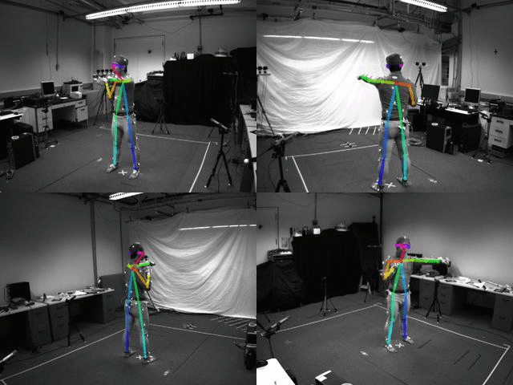

# Openpose+IMU-Pose-classify

The code serves to manage the action standard in the home rehabilitation, and the current database already supports the classification task of realizing six different actions. The classification of human activities uses a 2D pose and a 3D transformation time series datasets and an LSTM RNN.  
The 2D pose time seires dataset is transformed from videos, while the 3D transformation time series datasets is transformed from accelerators data.  
The idea is to prove the concept that using both series of 2D pose and 3D transformation, rather than only using one of them, can produce an accurater estimation of the behaviour of a person.
This is a step towards creating a method of classifying an human's current behaviour state and predicting it's likely next state, allowing for better self motion management in the home rehabilitation.  

## Objectives

The aims of this experiment are:

- To transform the raw 2D videos into 2D position of 18 interested joints across a timeseries of frames. This serves to the following use of LSTM RNN model.    
- To analyze the importance of the choosen 18 joints. This is based on the idea of adding IMU accelerators at joints that are much missing from the videos but are important to the results.  
- To determine if 2D pose together with 3D transformation time series has comparable accuracy to using only one of them for use in activity recognition. This is to verify joints importance analysis.  
- To verify the concept for use in future works managing the action standard in the home rehabilitation using only few accelerator device and a single camera.

The network used in this experiment is based on that of Guillaume Chevalier, 'LSTMs for Human Activity Recognition, 2016'  https://github.com/guillaume-chevalier/LSTM-Human-Activity-Recognition, available under the MIT License, and Stuart Eiffert, 'RNN for Human Activity Recognition - 2D Pose Input, 2017 https://github.com/stuarteiffert/RNN-for-Human-Activity-Recognition-using-2D-Pose-Input.

## Dataset overview

Unzip the data.zip file in CameraData.  

The dataset consists of pose estimations, made using the software OpenPose (https://github.com/CMU-Perceptual-Computing-Lab/openpose's) on a subset of the Berkeley Multimodal Human Action Database (MHAD) dataset http://tele-immersion.citris-uc.org/berkeley_mhad.  

This dataset is comprised of 12 subjects doing the following 6 actions for 5 repetitions, filmed from 4 angles, repeated 5 times each.  

- JUMPING,  
- JUMPING_JACKS,  
- BOXING,  
- WAVING_2HANDS,  
- WAVING_1HAND,  
- CLAPPING_HANDS.  

In total, there are 1438 videos (2 were missing) made up of 211200 individual frames.

The below image is an example of the 4 camera views during the 'boxing' action for subject 1

The input for the LSTM is the 2D position of 18 joints and 3D transformation of 6 joints across a timeseries of frames, with an associated class label for the frame series.  
A single frame's input (where j refers to a joint) is stored as:

[  j0_x,  j0_y, j1_x, j1_y , j2_x, j2_y, j3_x, j3_y, j4_x, j4_y, j5_x, j5_y, j6_x, j6_y, j7_x, j7_y, j8_x, j8_y, j9_x, j9_y, j10_x, j10_y, j11_x, j11_y, j12_x, j12_y, j13_x, j13_y, j14_x, j14_y, j15_x, j15_y, j16_x, j16_y, j17_x, j17_y ,  jt0_x,  jt0_y,  jt0_z, jt1_x, jt1_y , jt1_z , jt2_x, jt2_y, jt2_z , jt3_x, jt3_y, jt3_z , jt4_x, jt4_y, jt4_z , jt5_x, jt5_y, jt5_z ]  

For the following experiment, very little preprocessing has been done to the dataset.  
The following steps were taken:
- for 2D position data:  
1. openpose run on individual frames, for each subject, action and view, outputting JSON of 18 joint x and y position keypoints and accuracies per frame
2. JSONs converted into txt format, keeping only x and y positions of each frame, action being performed during frame, and order of frames. This is used to create a database of associated activity class number and corresponding series of joint 2D positions
- for 3D transformation data:  
1. Interpolate the accelerators data and downsample it to match the sample rate of camera frames.  

A summary of the dataset used for input is:  

 - 211200 individual images 
 - Accelerometer captures motion data at approximately 30 Hz
 - Training_split = 0.8
   - Length X_train = 3474 * 32 frames * (18\times2+6 \times3)
   - Length X_test = 869 * 32 frames * (18 \times2+6 \times3)
   
   
   
   
## Analysis of camera data:  
Run the code "DataAnalysis.ipynb" to visualize the data analysis.  

## Training and Results below:   
Training took approximately 14 mins running on a single AMD Radeon(TM) Graphics for each among the 3 models, and was run for 100 epochs with a batch size of 4096.  

Run the code "ModelTraining.ipynb" to train and get result.

## Conclusion

Final accuracy of 93.9% is pretty good, considering that the model using only camera dataset has accuracy of 91.5%, and the model using only IMU accelerators dataset has accuracy of 79.6%.

The miisclassification cases have signifficantly reduced in our model compared with the other two models. Noticeable confusion between activities of Clapping Hands and Boxing, and between Jumping Jacks and Waving Two Hands which is understandable.  

Overall, this experiment validates the idea that 2D pose together with few IMU accelerators can be used for human activity recognition, and provides verification to continue onto management of the action standard in the home rehabilitation.
 

   
  

## Future Works
Further research will be made into the use on more subtle activity classes: normal versus abnormal behaviour, based on a baseline of normal motion.  

Inclusion of :
 - Collect videos for standard and not standard rehabilitation motions  
 - Collect the IMU accelerators data on more joints for standard and not standard rehabilitation motions  
 - Denoising the IMU accelerators data  
 - Train single model for special rehabilitation motions  
 - Analyze and evaluate the effect of accelerator placed on different joint for special rehabilitation motions  

## 
